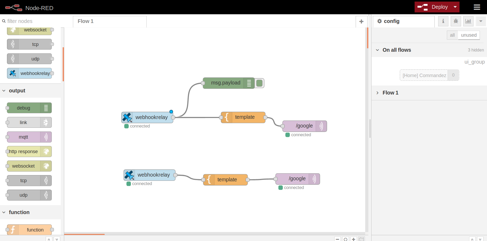
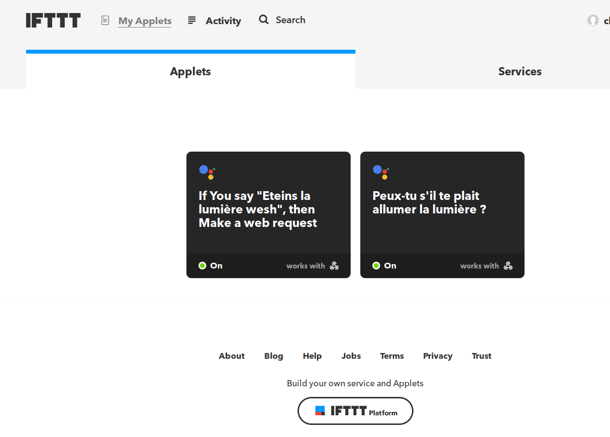

# OK-GOOGLE-
Ce projet à été réalisé par [@WiLDCaT](https://github.com/wildcat7534); [@OlgaBd](https://github.com/olgaBd)

## VIDEO

## BIBLIOTHEQUE UTILISEE
+ HCSR04.h
+ WiFi.h
+ Adafruit_MQTT.h
+ Adafruit_MQTT_Client.h

## MATERIEL
- Bread Board
- Carte ESP32
- une LED
- Resistance

## SCHEMA ELECTRIQUE

## NODE-RED

## IFTTT

    
